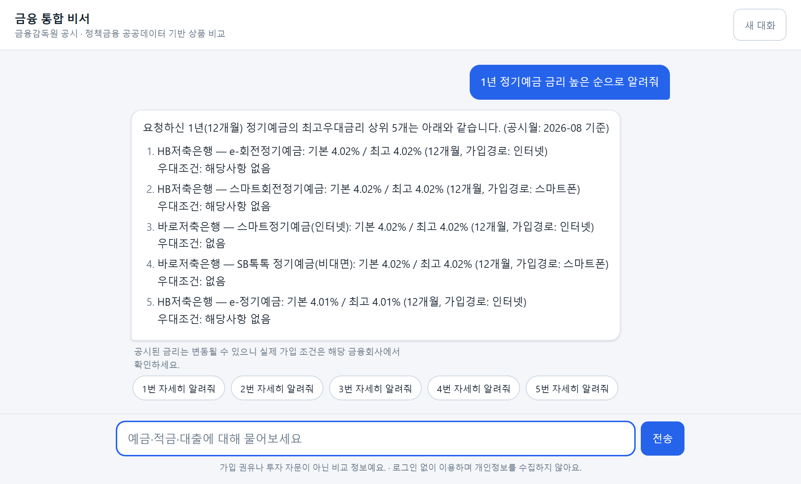
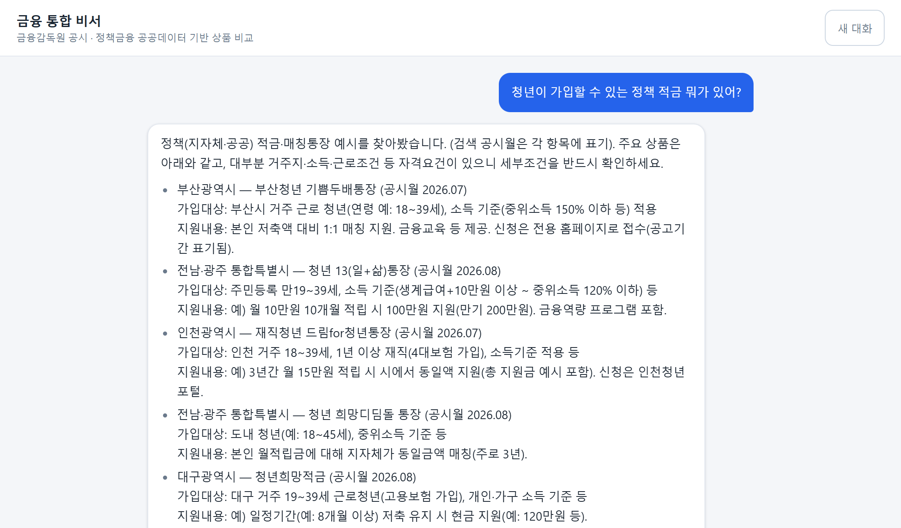
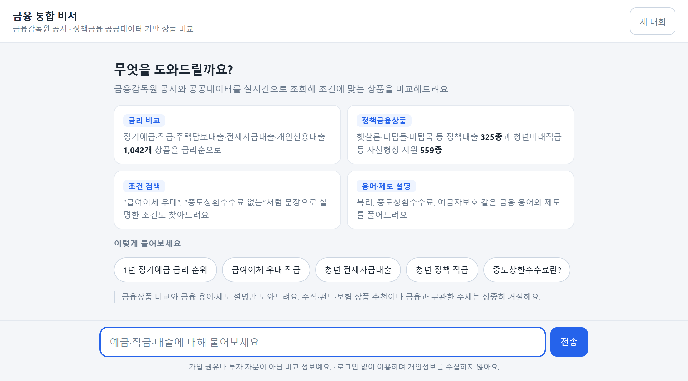
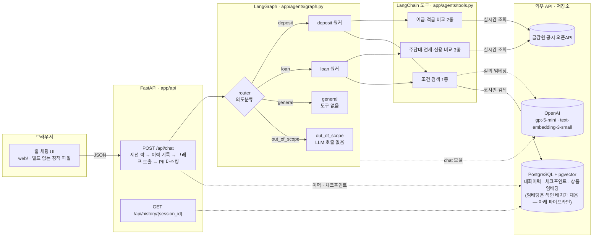
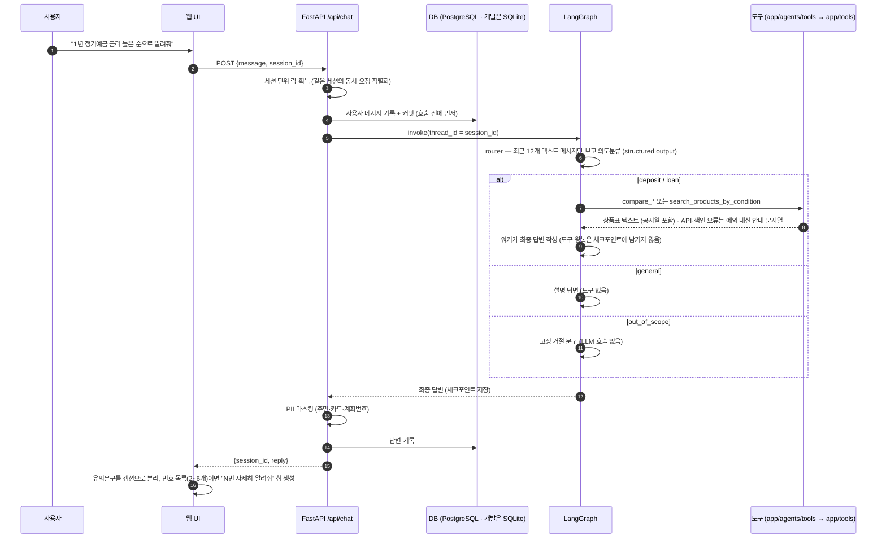
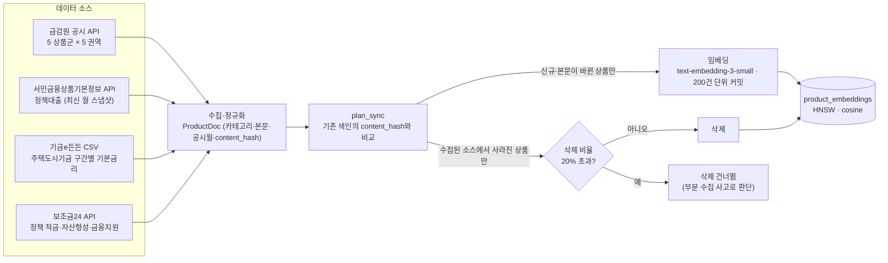

# 금융 통합 비서 (Finance Assistant)

[](https://github.com/Juminn/finance-assistant/actions/workflows/ci.yml)


정기예금·적금·주택담보대출·전세자금대출·개인신용대출과 햇살론·디딤돌 같은 정책금융상품을
**한 채팅창에서 비교·상담**하는 LLM 에이전트입니다. 금리는 금융감독원 공시 API를
실시간으로 조회하고, "급여이체 우대가 있는 적금"처럼 문장으로 된 조건은 pgvector
시맨틱 검색으로 찾습니다. 상품·금리 답변은 도구가 조회한 데이터로만 만들고(용어·제도 설명은
모델 지식으로 답합니다), 금융과 무관한 질문은 의도분류 단계에서 끊어 답변 생성 호출 없이
고정 문구로 거절합니다.

| 단위 테스트 | 통합 테스트 | 의도분류 골든셋 | 외부 데이터 소스 | 색인 상품 문서 | 에이전트 도구 |
| :---: | :---: | :---: | :---: | :---: | :---: |
| 210 | 6 | 114문항 | 4 | 1,964 (2026-09-03) | 6 |

<p align="center">
  
</p>

<details>
<summary>더 보기 — 정책 적금 조건 검색 답변, 첫 화면</summary>
<p align="center"></p>
<p align="center"></p>
</details>

### 눈여겨볼 설계 판단

- **정형 조건과 문장 조건을 다른 경로로 처리합니다.** 금리·기간은 공시 API를 실시간 조회해
  정렬하고, 우대조건·가입대상은 pgvector 시맨틱 검색으로 찾습니다. 한 검색으로 합치지 않습니다.
- **범위 밖 질문은 프롬프트가 아니라 라우팅으로 끊습니다.** `out_of_scope` 노드는 LLM을 호출하지
  않고 고정 문구를 돌려주므로 거절 문구 자체는 말로 바꿀 수 없습니다. 다만 어디로 보낼지는
  분류기(LLM)가 정하므로 라우팅 오류는 eval의 `boundary` 문항으로 감시합니다.
- **LLM 입력은 사람·AI 텍스트 최근 12개만 넣습니다.** 워커의 도구 왕복은 체크포인트에 남기지 않아
  분류기 입력이 비대해지거나 다른 워커가 남의 도구를 흉내 내는 일을 막습니다.
- **검색 파라미터는 실측으로 정했습니다.** 유사도 하한 0.35는 관련 결과와 도메인 밖 질의의 유사도
  분포를 재서 그 사이에 둔 값이고, `top_k` 10은 정책 적금이 공시 상품에 밀려 잘리는 순위를 재서
  고른 값입니다.

근거와 코드 위치는 [설계 결정과 근거](#설계-결정과-근거)에 정리했습니다.

## 목차

- [무엇을 할 수 있나](#무엇을-할-수-있나)
- [아키텍처](#아키텍처)
  - [시스템 구성](#시스템-구성) · [요청 처리 흐름](#요청-처리-흐름) · [의도 라우팅](#의도-라우팅)
  - [상품 색인 파이프라인](#상품-색인-파이프라인-배치) · [조건 검색 파라미터](#조건-검색-파라미터) · [저장소](#저장소)
- [설계 결정과 근거](#설계-결정과-근거)
- [데이터 소스](#데이터-소스)
- [품질 보증](#품질-보증)
- [시작하기](#시작하기)
- [프로젝트 구조](#프로젝트-구조)
- [개발 워크플로우](#개발-워크플로우)
- [한계와 다음 단계](#한계와-다음-단계)

## 무엇을 할 수 있나

| 질문 유형 | 예시 | 처리 경로 |
| --- | --- | --- |
| 금리 순위 비교 | "1년 정기예금 금리 높은 순으로 알려줘" | `deposit` 워커 → 금감원 공시 API 실시간 조회 (전 금융권역, 최고우대금리 순) |
| 대출 금리 비교 | "주택담보대출 금리 낮은 곳" | `loan` 워커 → 주담대·전세·신용대출 비교 도구 |
| 문장 조건 검색 | "급여이체 우대 있는 적금", "중도상환수수료 없는 대출" | 워커 → pgvector 시맨틱 검색 (우대조건·가입대상·상환방식 색인) |
| 정책금융상품 | "청년이 가입할 수 있는 정책 적금", "신생아 특례 대출 조건" | 워커 → 같은 시맨틱 검색. 정책대출·정책지원은 별도 카테고리, 정책 적금·통장은 공시 상품과 같은 `적금` 카테고리에 색인 |
| 용어·제도 설명 | "중도상환수수료가 뭐야?" | `general` 노드 → 도구 없이 설명 (조회 불가 상품은 특정 상품을 추천하지 않음) |
| 후속 질문 | "그중 두 번째 거 자세히" | 세션 체크포인트로 이전 턴을 참조 |
| 금융 밖 질문 | "파이썬 정렬 코드 짜줘" | `out_of_scope` 노드 → 답변 생성 호출 없이 고정 문구로 거절 |

- 로그인 없이 사용합니다. 세션 ID는 서버가 uuid4로 발급하며, 별도 인증이나 형식 검증은 없습니다.
- 상품 조회 결과에는 공시월(데이터 기준 시점)이 항상 붙고, 워커 프롬프트가 답변에 공시월과
  유의문구를 넣도록 지시합니다. 가입 권유·투자 권유는 프롬프트로 금지합니다.

## 아키텍처

### 시스템 구성



- 레이어 의존 방향은 `api → agents → tools/db`, `batch → tools/db`로 고정하고 역방향 import를
  금지합니다 (규칙은 [`CLAUDE.md`](CLAUDE.md), 자동 검사는 아직 없습니다).
- `app/tools/`는 LLM 의존성이 없는 순수 함수이고 `httpx` 클라이언트를 인자로 받습니다.
  `app/agents/tools.py`가 이를 LangChain 도구로 감싸며, 외부 API는 `respx`로 mock해 오프라인에서
  테스트합니다.
- 상품 임베딩은 요청 경로가 아니라 색인 배치가 채웁니다. 배치는 금감원 공시 외에 정책금융
  공공데이터 세 소스도 수집합니다 — [상품 색인 파이프라인](#상품-색인-파이프라인-배치).

### 요청 처리 흐름



### 의도 라우팅

그래프는 `START → router → (deposit | loan | general | out_of_scope) → END`의 단일 분기입니다.
워커끼리 핸드오프하거나 루프를 도는 supervisor 패턴이 아니라, **분류 노드 1회 뒤 워커 노드 하나**만
실행되는 라우터 구조라 워커 간 루프가 없습니다. 워커 안에서는 도구 호출 → 결과 → 재호출의
tool-calling 루프가 돌며, 반복 상한은 따로 두지 않았습니다 (`create_agent`가 거는 기본
`recursion_limit`이 9,999라 사실상 무제한). `router`는 최근 대화를 보고
`Literal["deposit", "loan", "general", "out_of_scope"]` 스키마의 structured output으로 분류하며,
모델 거절·파싱 실패는 예외로 잡혀 `general`로 폴백합니다. 분류 기준은
[`evals/README.md`](evals/README.md)의 라벨링 규칙(R1~R6)에 맞춰 잡았습니다.

| 의도 | 기준 | 노드가 쓰는 것 |
| --- | --- | --- |
| `deposit` | 예·적금(정책 적금·자산형성 포함)을 **찾거나 비교**하려는 질문 | 워커 — `compare_deposit_products` · `compare_saving_products` · `search_products_by_condition` |
| `loan` | 주담대·전세·신용대출(정책대출 포함)을 **찾거나 비교**하려는 질문 | 워커 — `compare_mortgage_loans` · `compare_rent_loans` · `compare_credit_loans` · `search_products_by_condition` |
| `general` | 금융이지만 상품 탐색이 아닌 것 — 용어·제도 설명, 조회 불가 상품(주식·펀드·보험), 인사 | 도구 없는 단일 LLM 호출. 조회 불가 상품은 특정 상품·회사를 추천하지 않고 비교 가능한 상품으로 안내 |
| `out_of_scope` | 금융·경제와 무관한 요청 (날씨·코딩·번역·창작·잡담) | LLM 호출 없음. 고정 문구로 거절하며 대신 할 수 있는 일을 안내 |

턴당 호출 예산:

| 의도 | LLM 호출 | 외부 호출 | 타임아웃 |
| --- | --- | --- | --- |
| `out_of_scope` | 분류 1회 | 없음 | — |
| `general` | 분류 1회 + 답변 1회 | 없음 | 채팅 모델은 라이브러리 기본값 (별도 설정 없음) |
| `deposit` · `loan` | 분류 1회 + 워커 루프 (도구 호출 라운드 수 + 1 — 한 라운드에 여러 도구를 병렬로 부를 수 있음) | 금감원 API 5개 권역 동시 조회 (httpx 10초) · 질의 임베딩 (OpenAI 10초, 재시도 1회) | 채팅 모델은 라이브러리 기본값 |

분류 호출은 모든 경로에서 1회 돌므로 거절 경로가 아끼는 것은 답변 생성 1회분(실측 입력 233 /
출력 427 토큰)입니다. 지연시간은 아직 측정하지 않았습니다. 모든 LLM 입력에 넘기는 대화 이력은
사람·AI 텍스트 **최근 12개**로 제한하므로 세션이 길어져도 이력 때문에 입력이 커지지는 않습니다
(메시지 개수 기준이라 토큰 상한은 아닙니다).

### 상품 색인 파이프라인 (배치)



- 한 소스의 장애가 배치 전체를 멈추지 않습니다. 실패한 소스는 건너뛰고, 삭제는 **이번에 실제로
  수집된 소스** 안에서만 계산하므로 건너뛴 소스의 기존 색인은 보존됩니다.
- 청크 단위로 임베딩 → 저장 → 커밋을 반복하므로 중간에 실패해도 재실행 시 이어서 진행됩니다.
- 단위 테스트는 `plan_sync`·`is_mass_deletion`(해시 비교, 수집된 소스 안에서만 삭제, 20% 게이트 판정)까지이고,
  `sync_catalog.main`의 오케스트레이션(소스 건너뛰기·청크 커밋·게이트 적용)은 실제 실행으로만 확인합니다.

### 조건 검색 파라미터

| 항목 | 값 | 근거 |
| --- | --- | --- |
| 임베딩 | `text-embedding-3-small` · 1536차원 | 응답을 `index`로 재정렬하고 개수·차원이 어긋나면 즉시 실패 |
| 인덱스 | pgvector HNSW · 코사인 거리 | `product_embeddings` 테이블, 카테고리 컬럼 인덱스로 좁힌 검색 |
| `top_k` | 10 | 5건이면 전국 단위 정책 적금이 지자체 통장·시중 적금에 밀려 잘림 (실측: "청년 적금" 질의에서 청년미래적금 9위) |
| 유사도 하한 | 0.35 | 관련 결과 최저 0.425, 도메인 밖 질의 0.20~0.33 사이. 0.45로 올리면 관련 80건 중 14건 손실 |
| 카테고리 추론 | 질의에 단서가 **하나**일 때만 좁힘 | 둘 이상 걸리면 전체 검색. 잘못 좁혀 통째로 잃는 쪽이 더 나쁨 |
| 정책 예·적금 배치 | 공시 상품과 같은 `정기예금`·`적금` 카테고리 | 카테고리로 좁힌 검색은 다른 칸을 보지 못하므로 상품 성격이 같으면 한 칸에 둠 |
| 한계 | 보험·퇴직연금처럼 인접 도메인 질의는 유사도 0.41~0.47로 겹침 | 이 구간은 임계값으로 못 거르고 router·워커 프롬프트가 맡음 |

위 실측치는 2026-08 색인 기준 수동 측정입니다 — 유사도 하한은 정책상품을 합치기 전(공시 1,042건),
`top_k`는 합친 뒤 시점의 값입니다. 수치를 재산출하는 스크립트는 아직 없고,
`tests/integration/test_vector_search.py`가 실제 색인에서 임계값·`top_k` 회귀만 검사합니다.
값과 근거는 [`app/tools/condition.py`](app/tools/condition.py)와
[`app/agents/tools.py`](app/agents/tools.py)의 주석에 같은 내용으로 남겨 두었습니다.

### 저장소

| 테이블 | 메타데이터 | 내용 | 비고 |
| --- | --- | --- | --- |
| `chat_messages` | `Base` | 세션별 대화 원문 (`GET /api/history/{session_id}`) | SQLite에서도 생성 |
| `product_embeddings` | `VectorBase` | 상품 문서 + 1536차원 임베딩, `content_hash`, 공시월 | PostgreSQL 전용. 스키마(확장·테이블·HNSW 인덱스)는 색인 배치가 만듦 |
| LangGraph 체크포인트 | `PostgresSaver.setup()` | 세션(`thread_id`)별 그래프 상태 | PostgreSQL이면 대화 원문과 같은 DB에 영속 (메모리에만 있으면 재시작 후 이력 API와 어긋남). 아니면 `MemorySaver` |

## 설계 결정과 근거

대부분 항목의 "왜"는 해당 코드의 docstring·주석에도 같은 취지로 남겨 두었습니다.

| 문제 | 결정 | 근거 |
| --- | --- | --- |
| 금리·기간 같은 정형 조건과 우대조건·가입대상 같은 문장 조건은 성격이 다르다 | **정형 조건은 API 실시간 조회 + 정렬**, **문장 조건은 pgvector 시맨틱 검색**으로 분리 | 금리 정렬은 비교 도구(정렬·필터)가, "급여이체 우대" 같은 문장 조건은 시맨틱 검색이 맡도록 역할을 나눴다 ([`app/tools/catalog.py`](app/tools/catalog.py), [`app/agents/tools.py`](app/agents/tools.py)) |
| 프롬프트로만 범위를 막으면 대화를 이어가며 설득당할 여지가 남는다 | 범위 밖 질문은 **라우팅 단계에서 `out_of_scope` 노드로 끊고 고정 문구**를 반환 | 거절 문구는 LLM이 생성하지 않아 말로 바꿀 수 없다. 라우팅 자체는 분류기(LLM)에 달려 있으므로 eval의 `boundary` 문항으로 감시한다. 분류 호출은 어차피 돌므로 아끼는 것은 답변 생성 호출 1회다 ([`app/agents/graph.py`](app/agents/graph.py)) |
| 의도분류 호출이 실패하면 요청 전체가 502로 번진다 | 분류 실패·형식 불일치는 **`general`로 폴백** | 분류는 답변을 보조하는 단계라 여기서 죽으면 안 된다. 구제 범위는 파싱 실패·모델 거절처럼 분류만의 실패이고, OpenAI 장애처럼 `general` 호출도 함께 죽는 경우는 여전히 502다 ([`app/agents/graph.py`](app/agents/graph.py)) |
| 워커의 도구 왕복(상품표 전문)이 이력에 쌓이면 router 입력이 매 턴 비대해지고, 다른 워커가 남의 도구를 흉내 내며, tool_calls 짝이 잘리면 OpenAI가 400을 낸다 | LLM 입력은 **사람·AI 텍스트만 최근 12개**로 정리하고, 워커의 최종 답변만 상태에 남긴다 | 후속 질문에 필요한 정보(상품명·금리)는 최종 답변 텍스트에 이미 있다 ([`history_for_llm`](app/agents/graph.py)) |
| 도구가 예외를 던지면 워커 루프가 깨지고 요청 전체가 502가 된다 | 인증키 부재·공시 API 오류(HTTP·타임아웃·오류코드)·색인 미준비·조건 검색의 모든 예외는 **예외 대신 안내 문자열**로 돌려 모델이 읽게 하고, 워커 프롬프트가 대체 경로(색인 미준비면 비교 도구의 우대조건으로, 못 찾았으면 금리 비교 제안으로)를 지시 | 모델이 실패를 알아야 대체 도구를 고르거나 "조회하지 못했다"고 말할 수 있다. 도구 인자 형식 오류는 LangGraph가 오류 메시지를 모델에 되돌려주고, 그 밖의 예외(응답 파싱 실패 등)는 감싸지 않아 502가 된다 ([`app/agents/tools.py`](app/agents/tools.py), [`app/agents/prompts.py`](app/agents/prompts.py)) |
| 같은 세션의 동시 요청이 같은 체크포인트에서 갈라지면 한쪽 턴이 사라진다 | **세션 단위 스트라이프 락(64개)** 으로 직렬화하고, 사용자 메시지는 호출 **전에** 기록·커밋 | 세션마다 락을 만들면 새고, 실패한 턴도 체크포인터에는 남으므로 화면 이력과 어긋나지 않게 한다 ([`app/api/chat.py`](app/api/chat.py)) |
| 한 권역 응답이 조용히 비어 오면 그 권역 상품 전체가 삭제 대상이 된다 | 삭제가 기존 색인의 **20%를 넘으면 사고로 보고 삭제를 건너뛴다** | 정상적인 월 단위 변동폭을 크게 넘는 삭제는 부분 수집이다 ([`app/batch/sync.py`](app/batch/sync.py)) |

그 밖의 방어적 구현: LLM 답변은 신뢰할 수 없는 문자열로 다뤄 웹 UI가 `innerHTML` 없이
`createElement`·`createTextNode`로만 마크다운을 조립합니다 ([`web/app.js`](web/app.js)).
조건 검색 실패([`app/agents/tools.py`](app/agents/tools.py))와 에이전트 호출 실패([`app/api/chat.py`](app/api/chat.py))의
예외 원문(호스트명·계정)은 로그에만 남기고 사용자에게는 안내 문구만 보내며, 실패 로그에도 `session_id`는
앞 8자만 남깁니다.
벡터 테이블은 별도 메타데이터 `VectorBase`에 두어 SQLite 테스트 DB에 생기지 않게 하고
([`app/db/vector_base.py`](app/db/vector_base.py)), Neon이 유휴 시 컴퓨트를 내리는 것에 대비해
SQLAlchemy `pool_pre_ping`과 psycopg 풀의 `check_connection`으로 끊긴 커넥션을 미리 걸러냅니다.
정적 파일은 `Cache-Control: no-cache`로 내려 새 HTML과 낡은 JS가 섞이지 않게 합니다.

## 데이터 소스

| 소스 | 제공 | 색인 카테고리 | 갱신 | 인증키 |
| --- | --- | --- | --- | --- |
| [금융감독원 금융상품통합비교공시](https://finlife.fss.or.kr) 오픈API | 정기예금·적금·주택담보·전세자금·개인신용대출 — 은행·저축은행·여신전문·보험·금융투자 5개 권역 (1,042건) | 정기예금 / 적금 / 주택담보대출 / 전세자금대출 / 개인신용대출 | 월 단위 공시 (`dcls_month`) | `FINLIFE_API_KEY` |
| [서민금융상품기본정보](https://www.data.go.kr) API (금융위원회) | 햇살론·디딤돌·버팀목·보금자리론 등 정책대출 (325건) | 정책대출 | 월별 스냅샷 — 최신 월만 수집, 폐지 상품 제외 | `DATA_GO_KR_API_KEY` |
| [기금e든든](https://www.data.go.kr) CSV (주택도시기금) | 신생아 특례·청년 주택드림 등 세부 상품과 소득·보증금·기간 구간별 기본금리 (38건) | 정책대출 | 연 1회 스냅샷 (기준 2025-10) | 불필요 |
| [대한민국 공공서비스(혜택)](https://www.data.go.kr) API (보조금24) | 1만여 건 중 금융 키워드로 거른 청년미래적금·청년내일저축계좌·이자지원 등 (559건) | 성격에 따라 정기예금 / 적금 / 정책대출 / 정책지원 | 항목별 수정일시 기준 (주기 미고정) | `DATA_GO_KR_API_KEY` |

건수는 2026-09-03 현재 `product_embeddings` 색인 기준(합계 1,964건)입니다.

- 금리 비교 도구는 매 요청마다 5개 권역을 **동시에** 조회해 합칩니다. 배치는 위 네 소스를
  모두 수집해 벡터 저장소에 색인합니다.
- 카테고리는 데이터 출처가 아니라 **상품 성격**으로 정합니다. 보조금24의 융자 혜택은 정책대출로,
  통장·적금성 지원은 공시 상품과 같은 예·적금 칸으로 보내고, 정책대출 소스와 이름이 겹치는
  서비스(햇살론 등)는 정책대출 소스를 정본으로 남깁니다.

## 품질 보증

결정적 코드(도구·DB·API·라우팅 로직)는 **TDD**로, LLM 동작은 **골든셋 eval**로 검증합니다.

| 항목 | 내용 |
| --- | --- |
| 단위 테스트 | 210개 — 외부 HTTP는 `respx`로 mock, DB는 SQLite in-memory. 오프라인·10초 남짓에 완료 |
| 통합 테스트 | 6개 — 실 API·실 pgvector 대상, `-m integration`으로만 실행. 키·DB가 없으면 skip |
| 의도분류 eval | 골든셋 114문항 (`core` 75 · `boundary` 39, 멀티턴 6). 로컬에서 수동 실행 (API 비용 때문에 CI 미포함). `core` 90% 미달 시 exit 1이지만 머지 조건으로 강제하지는 않음 |
| 정적 검사 | `ruff` (E·F·W·I·UP·B·SIM·C4·RUF), `pyright` (strict 모드, `pyproject.toml` 설정) |
| CI | GitHub Actions — PR과 `main` push마다 lint → format check → typecheck → unit test |
| pre-commit | Python 파일이 포함된 커밋마다 ruff check → ruff format → pyright → pytest(unit) |
| 머지 규칙 | 기능 브랜치 → PR → CI 통과 → `--rebase` 머지를 작업 규칙으로 둡니다 (브랜치 보호로 강제하지는 않음) |

테스트가 지키는 동작의 예:

- 같은 세션의 동시 요청은 겹치지 않고 차례로 처리된다
- 분류 호출이 실패하면 `general`로 폴백한다 / 범위 밖 질문은 답변 생성 LLM을 호출하지 않는다 (분류 호출은 거친다)
- 에이전트가 실패해도 사용자 메시지는 이력에 남고, 실패 로그에 `session_id` 전문이 남지 않는다
- 답변의 주민·카드·계좌번호는 마스킹되어 나간다
- 대량삭제 판정(`is_mass_deletion`)이 기존 색인의 20%를 넘는 삭제를 잡아낸다
- 임베딩 응답의 개수·차원이 어긋나면 조용히 오염되지 않고 즉시 실패한다

### 의도분류 eval

```bash
uv run python evals/run_evals.py          # 프롬프트·그래프를 바꾸면 로컬에서 실행
uv run python evals/run_evals.py --trace  # 오답 원인을 LangSmith로 추적할 때만
```

2026-09-03 로컬 실행 결과 (`gpt-5-mini`, 프롬프트 커밋 `11ad45c`, 3회 실행 중 첫 번째. 저장소에 결과 파일은 두지 않음):

```
전체 정확도: 96.5% (110/114)

  tier별
    core      100.0% (75/75)
    boundary   89.7% (35/39)

  정답 라벨별 (core)
    deposit   100.0% (25/25)
    loan      100.0% (23/23)
    general   100.0% (19/19)
    out_of_scope 100.0% (8/8)

core 기준(90%) 통과.
```

- 골든셋 라벨은 **제품이 어떻게 답해야 하는가**로 정합니다. 모델 출력을 보고 맞추면 eval이
  자기 자신을 채점하게 됩니다.
- `boundary`는 표면 단서가 오도하는 문항 묶음("햇살론이 뭐야?"는 상품명이 있지만 설명 요청)이라
  원래 낮게 나옵니다. 이 수치를 올리려고 문항을 쉽게 바꾸지 않으며, 기준선은 `core`에만 겁니다.
- `out_of_scope`는 거절 누락과 과잉거절 **양방향**을 함께 채점합니다.
- eval은 그래프 전체가 아니라 `router` 노드를 직접 호출합니다. 멀티턴 문항의 `history`는 실제
  서비스에서 router가 받는 것과 같은 사람·AI 텍스트 목록이라 입력 모양이 같습니다.
- 분류기는 비결정적이라 `boundary` 오답은 실행마다 몇 건씩 바뀝니다 (같은 날 3회 실행: `core`는 3회 모두 75/75, `boundary`는 35~36/39).
  프롬프트를 고칠 때는 흔들리는 문항을 변경 전후로 여러 번 돌려 비교합니다.
- eval이 채점하는 것은 의도뿐입니다. 워커가 어떤 도구를 몇 번 호출했는지(예: 정책 적금 질문에서
  조건 검색을 함께 부르는지)는 채점하지 않습니다.
- 라벨링 규칙과 갱신 원칙: [`evals/README.md`](evals/README.md)

## 시작하기

```bash
# 1. 의존성 설치 (uv 필요: https://docs.astral.sh/uv/)
uv sync

# 2. 환경변수 — .env.example을 복사해 키를 채운다
cp .env.example .env

# 3. 상품 카탈로그를 벡터 저장소에 색인 — DATABASE_URL이 PostgreSQL일 때만.
#    조건 검색용. 최초 1회, 이후 주기적으로 재실행 (바뀐 상품만 재임베딩)
uv run python -m app.batch.sync_catalog

# 4. 서버 실행 후 http://localhost:8000 접속
uv run uvicorn app.api.main:app --reload --reload-dir app --reload-dir web
```

| 변수 | 필수 | 설명 |
| --- | --- | --- |
| `OPENAI_API_KEY` | ✅ | 의도분류·워커·임베딩에 사용. 채팅 모델은 `OPENAI_MODEL`(기본 `gpt-5-mini`), 임베딩 모델은 `text-embedding-3-small` 고정 |
| `FINLIFE_API_KEY` | ✅ | 금감원 공시 API. 없으면 금리 비교 도구가 안내 문구를 반환하고, 색인 배치도 공시 소스를 건너뜀 |
| `DATA_GO_KR_API_KEY` | 선택 | 서민금융상품기본정보·보조금24 수집. 없으면 배치가 이 두 소스만 건너뜀 (기금e든든 CSV는 키 없이 수집) |
| `DATABASE_URL` | 선택 | PostgreSQL(예: [Neon](https://neon.com) 무료 티어) 연결 문자열. pgvector 확장은 색인 배치가 활성화. **비우면 SQLite로 동작**하며 조건 검색과 체크포인트 영속화만 꺼짐 |
| `LANGSMITH_*` | 선택 | LangSmith 트레이싱. `thread_id`가 LangGraph config로 전달되므로 세션별로 묶어 볼 수 있음 |

## 프로젝트 구조

```
app/
  core/      설정(get_settings), PII 마스킹, 임베딩 호출
  tools/     외부 API 순수 함수 — finlife(공시 공통 호출) · deposit · saving · loan(공시 비교·포맷)
             · smfg · gigeum · gov24(정책) · catalog(색인 문서 수집) · condition(조건 검색 추론·포맷)
  agents/    LangGraph 그래프(router + 워커), 프롬프트 상수, 도구 바인딩
  db/        SQLAlchemy 모델·저장소 — 대화이력(Base) · 상품 임베딩(VectorBase) · 체크포인터
  batch/     카탈로그 수집 → 변경분 임베딩 → 색인 (sync_catalog)
  api/       FastAPI 앱, 챗·이력 라우터
web/         정적 채팅 UI (빌드 없음, 외부 라이브러리 없음)
evals/       의도분류 골든셋(golden.jsonl)과 채점 스크립트
docs/images/ README 스크린샷
tests/
  unit/        mock 기반, 오프라인
  integration/ 실 API·실 DB (-m integration)
```

## 개발 워크플로우

| 작업 | 명령 |
| --- | --- |
| 단위 테스트 | `uv run pytest` |
| 통합 테스트 | `uv run pytest -m integration` |
| 린트 / 포맷 | `uv run ruff check --fix .` · `uv run ruff format .` |
| 타입체크 | `uv run pyright` |
| 의도분류 eval | `uv run python evals/run_evals.py` |
| 상품 색인 배치 | `uv run python -m app.batch.sync_catalog` |
| pre-commit 설치 | `uv run pre-commit install` |

- 기능 브랜치 → PR → CI 통과 → `--rebase` 머지. `main`에 직접 커밋하지 않습니다.
- 커밋은 기능 단위로 작게, [Conventional Commits](https://www.conventionalcommits.org/) 형식.
- 프롬프트나 그래프 구조를 바꾸면 eval을 로컬에서 실행해 `core` 정확도가 떨어지지 않았는지 확인합니다.
- 상세 규칙: [`CLAUDE.md`](CLAUDE.md)

## 한계와 다음 단계

- 응답은 스트리밍이 아니라 한 번에 돌아옵니다. 금리 비교는 5개 권역 전 페이지를 매번 조회하므로
  수 초가 걸릴 수 있습니다 (UI가 5초·15초에 진행 단계를 안내).
- 환각 통제는 프롬프트 지시(도구 결과만 사용, 없는 수치는 지어내지 않음, 조회 불가 상품은 추천 금지)에
  의존합니다. 답변에 등장한 상품명이 같은 턴의 도구 출력에 있는지 확인하는 사후 검증은 없습니다.
- `general` 노드는 LLM 학습 지식으로 답하므로 제도 변경(예: 예금자보호 한도)이 늦게 반영될 수 있습니다.
  주요 제도 사실을 프롬프트에 주입하거나 문서 RAG를 붙이는 것이 다음 과제입니다.
- eval은 의도분류만 채점합니다. 답변 품질(유의문구·공시월 포함 여부)의 자동 채점은 미구현입니다.
- 워커의 tool-calling 루프 상한(`recursion_limit` 9,999)과 채팅 모델의 타임아웃·재시도는 따로 설정하지 않았습니다.
- 거절은 분류 결과에 의존합니다. 질문을 금융처럼 포장해 분류를 우회하는 프롬프트 인젝션에 대한 별도 방어는 없습니다.
- 세션 직렬화 락은 프로세스 메모리에 있어 단일 워커 전제입니다. 멀티 워커·복제본 배포에는
  DB 어드바이저리 락 등으로 바꿔야 합니다.
- PII 마스킹은 응답에만 적용되며 사용자 입력은 원문 그대로 저장됩니다.
- 세션 ID는 사실상 bearer 토큰입니다. 서버가 발급한 uuid4는 추측이 어렵지만, 클라이언트가 보낸 임의 값도
  검증 없이 받아들이며 이력 API에 별도 인증은 없습니다.
- `DATABASE_URL`이 SQLite면 체크포인트가 프로세스 메모리에만 있어 재시작 시 멀티턴 문맥이 사라집니다.
  SQLite는 개발·테스트 전용이라는 전제입니다.
- 웹 UI는 새로고침 시 세션을 버리므로 이전 대화 복원(`/api/history` 활용)은 미구현입니다.
- 유사도 하한 0.35로는 보험·퇴직연금 같은 인접 도메인 질의를 거르지 못합니다. 그 구간은 프롬프트가 맡습니다.
- 연금저축 등 공시 API의 나머지 상품 유형은 아직 다루지 않습니다.
- 색인 배치의 주기 실행, 대화이력 보존 정책, rate limit, 배포 구성은 미구현입니다.
